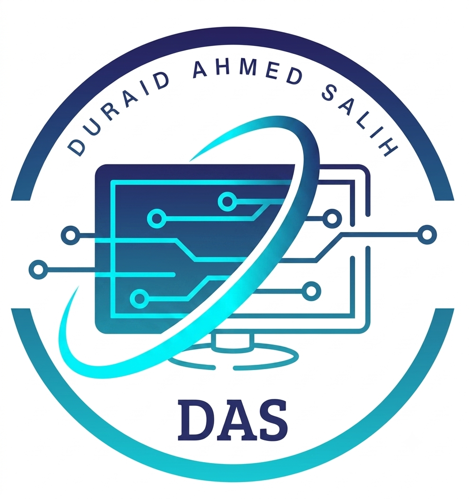

# الهوية البصرية والشعار الرسمي | DAS

مرحباً بك في صفحة التوثيق التقني للشعار الرسمي الخاص بـ دريد أحمد صالح، ماجستير علوم حاسوب تخصص ذكاء إصطناعي، برامج الذكاء الاصطناعي والبرمجيات والأنظمة الرقمية.

## الملف الشخصي (Professional Profile)
* **المؤهل الأكاديمي:** ماجستير علوم حاسوب - تخصص ذكاء إصطناعي                  (M.Sc. in Computer Science - Artificial Intelligence)
* **مجال الخبرة:** برامج الذكاء الاصطناعي، البرمجيات، والأنظمة الرقمية                    (AI Software, Development & Digital Systems)

---

## الشعار الأساسي (The Logo)

  

---

## الألوان الرسمية (Brand Colors)
تم استخراج الألوان الرقمية بدقة لتعكس الهوية التقنية والعمق البرمجي:

* 🔵 **الأزرق الداكن الملكي:** `HEX: #1D2D50` - يرمز للثقة، الأمان، والاستقرار البرمجي.
* 🔷 **الأزرق المتوسط:** `HEX: #1B5B8C` - يمنح التدرج الانسيابية والاتزان البصري.
* 🌐 **السيان الرقمي (Teal):** `HEX: #00D2D3` - يرمز للتطور، الابتكار، وحلول الذكاء الاصطناعي الذكية.

---

## الخطوط ونظام العرض (Typography)
* **عائلة الخطوط:** هندسية حديثة من نوع **Sans-Serif** لضمان وضوح القراءة على كافة الشاشات الرقمية.

## تعليمات الاستخدام الفني
1. يجب الحفاظ على نسب أبعاد الشعار (Aspect Ratio) عند التصغير أو التكبير دون تمطيط.
2. يفضل استخدام الشعار فوق خلفيات بيضاء صافية أو خلفيات داكنة تبرز التدرج اللوني بوضوح.

---

## حقوق الملكية الفكرية (Intellectual Property)
* 🔐 **بيان الحقوق:** جميع حقوق الملكية الفكرية، التصميم الهندسي، والفكرة الفنية لهذا الشعار محفوظة حصرياً لـ **دريد أحمد صالح © 2026**.
* 🚫 **القيود القانونية:** يُحظر تماماً إعادة استخدام، تقليد، تعديل، أو إعادة نشر هذا الشعار أو أجزاء منه في أي مشاريع برمجية، أبحاث أكاديمية، أو منصات رقمية أخرى دون إذن خطي ومسبق من المالك.
* 📌 **التوثيق الرقمي:** يُعتبر هذا المستودع وتاريخ نشره على منصة GitHub بمثابة بصمة زمنية رقمية (Timestamp) لإثبات أسبقية الابتكار والملكية الفكرية.
